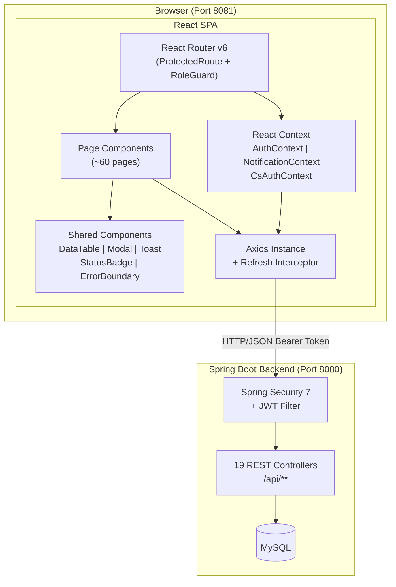
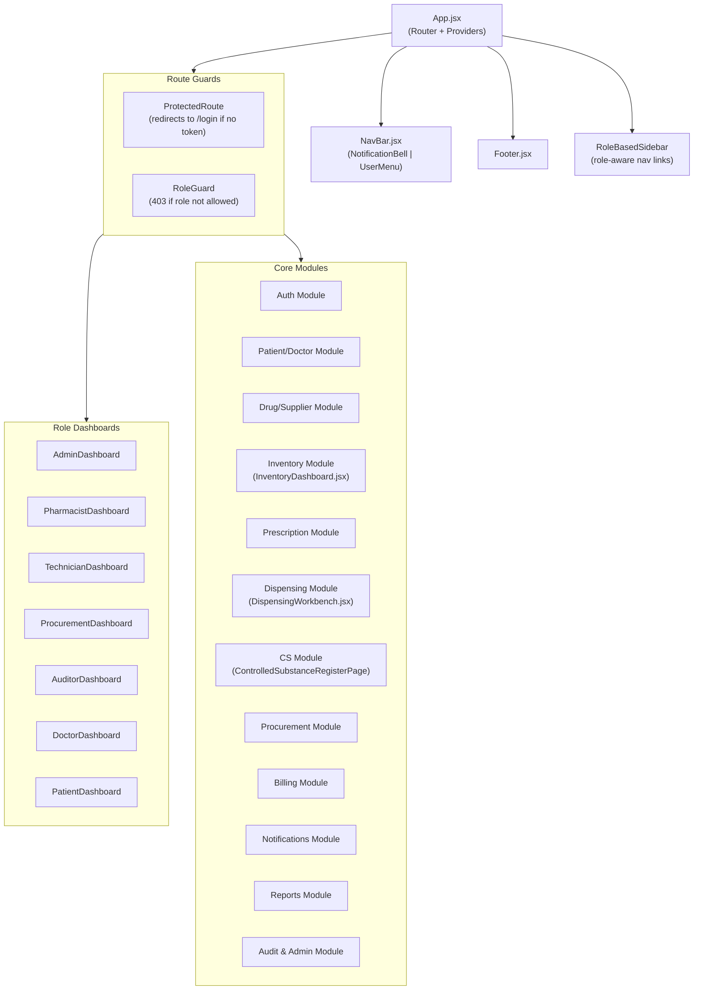
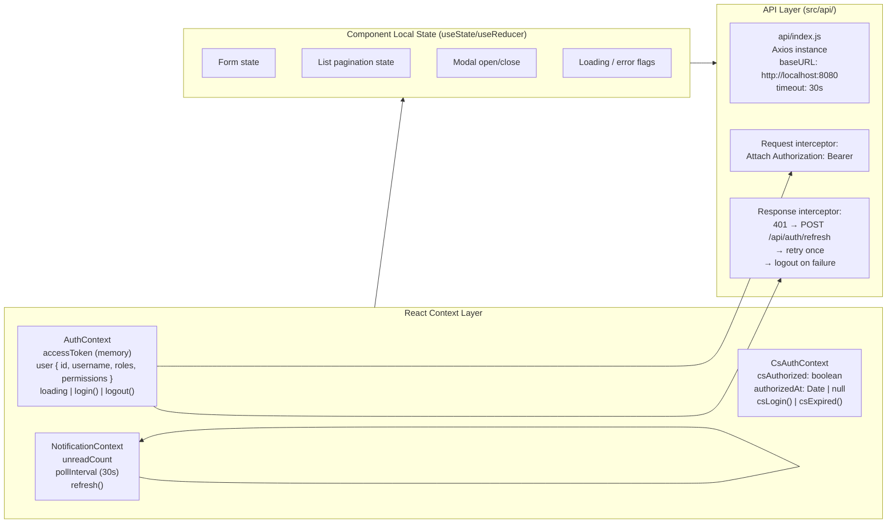
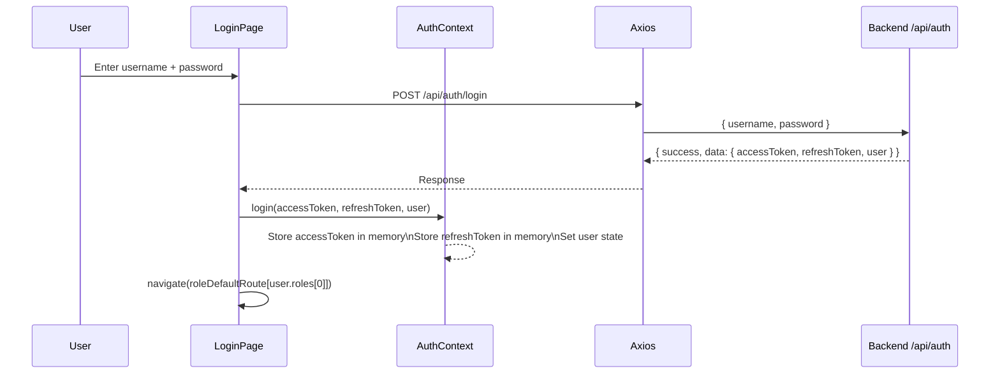
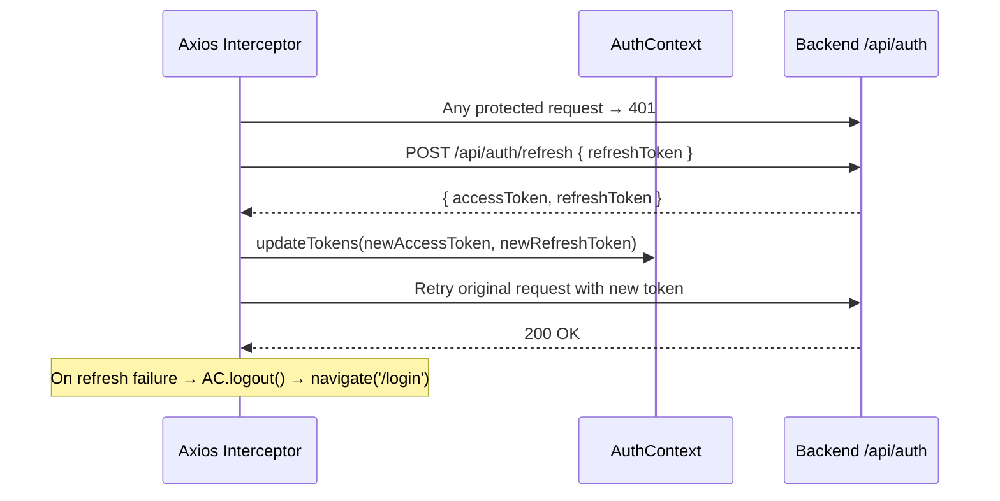
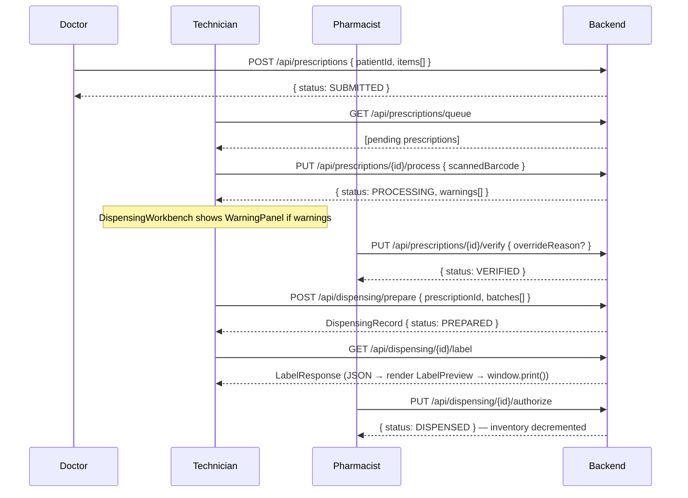
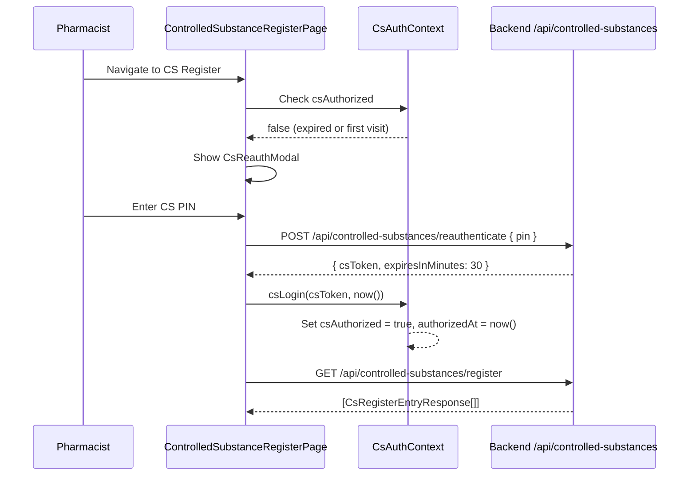

# Design Document: PIPMS React Frontend (Sprints 21–30)

## Overview

PIPMS (Pharmacy Inventory and Prescription Management System) is a role-based pharmacy operations platform. The frontend is a React.js single-page application that serves 7 authenticated roles (Admin, Pharmacist, Technician, Procurement Officer, Auditor, Doctor, Patient) plus an unauthenticated Guest, integrating with a Spring Boot 4.1.0 backend via 150+ REST endpoints. The application covers the full operational lifecycle: authentication, patient/doctor management, drug catalog, inventory with FEFO dispensing, prescription workflow, controlled-substance compliance, procurement, billing, notifications, reporting, and system administration — all with WCAG 2.1 AA accessibility built in from Sprint 21.

The frontend runs on **port 8081**, communicates with the backend on **port 8080**, stores access tokens in React Context (never localStorage), and uses Axios with silent-refresh interceptors for session continuity. All UI is built with plain CSS/CSS Modules — no third-party component library is assumed.

---

## Architecture

### High-Level System Architecture



### Application Layer Architecture



### State Management Architecture



---

## Sequence Diagrams

### Authentication Flow



### Token Refresh Flow



### Prescription-to-Dispense Workflow



### CS Re-Authentication Flow



---

## Components and Interfaces

### Route Structure

```typescript
// src/routes/routes.jsx
interface RouteConfig {
  path: string
  element: JSX.Element
  allowedRoles?: RoleName[]   // undefined = public
  requireCsAuth?: boolean      // CS pages only
}

const ROLE_DEFAULT_ROUTES: Record<RoleName, string> = {
  ROLE_ADMIN:               '/admin/dashboard',
  ROLE_PHARMACIST:          '/pharmacist/dashboard',
  ROLE_TECHNICIAN:          '/technician/dashboard',
  ROLE_PROCUREMENT_OFFICER: '/procurement/dashboard',
  ROLE_AUDITOR:             '/auditor/dashboard',
  ROLE_DOCTOR:              '/doctor/dashboard',
  ROLE_PATIENT:             '/patient/dashboard',
}
```

### ProtectedRoute Component

```typescript
// src/components/routing/ProtectedRoute.jsx
interface ProtectedRouteProps {
  children: ReactNode
}
// Behaviour: if !authContext.user → navigate('/login', { replace: true, state: { from: location } })
// Otherwise: render children
```

### RoleGuard Component

```typescript
// src/components/routing/RoleGuard.jsx
interface RoleGuardProps {
  allow: RoleName[]
  children: ReactNode
}
// Behaviour: if user.roles has none of allow → render <AccessDeniedPage />
// Otherwise: render children
```

### AuthContext

```typescript
// src/contexts/AuthContext.jsx
interface AuthState {
  accessToken: string | null        // in-memory only
  refreshToken: string | null       // in-memory only
  user: UserProfile | null
  loading: boolean
}

interface UserProfile {
  id: number
  username: string
  email: string
  roles: RoleName[]
  permissions: PermissionName[]
}

interface AuthContextValue extends AuthState {
  login(accessToken: string, refreshToken: string, user: UserProfile): void
  logout(): void
  updateTokens(accessToken: string, refreshToken: string): void
  hasPermission(permission: PermissionName): boolean
  hasRole(role: RoleName): boolean
}
```

### NotificationContext

```typescript
// src/contexts/NotificationContext.jsx
interface NotificationContextValue {
  unreadCount: number
  refresh(): void          // manually trigger poll
}
// Polls GET /api/notifications/unread-count every 30s when user is authenticated
// Uses setInterval, cleaned up on unmount/logout
```

### CsAuthContext

```typescript
// src/contexts/CsAuthContext.jsx
interface CsAuthContextValue {
  csAuthorized: boolean
  authorizedAt: Date | null
  csLogin(csToken: string): void
  csLogout(): void
  isExpired(): boolean     // returns true if authorizedAt + 30min < now()
}
```

### Shared Components

```typescript
// src/components/shared/DataTable.jsx
interface DataTableProps<T> {
  columns: ColumnDef<T>[]
  data: T[]
  loading: boolean
  pagination: PaginationState
  onPageChange(page: number): void
  onSort?(field: string, direction: 'asc' | 'desc'): void
  emptyMessage?: string
  'aria-label': string         // WCAG: table must have accessible name
}

interface ColumnDef<T> {
  key: keyof T | string
  header: string
  render?(value: unknown, row: T): ReactNode
  sortable?: boolean
  width?: string
}

interface PaginationState {
  pageNumber: number
  pageSize: number
  totalElements: number
  totalPages: number
  last: boolean
}
```

```typescript
// src/components/shared/Modal.jsx
interface ModalProps {
  isOpen: boolean
  onClose(): void
  title: string
  size?: 'sm' | 'md' | 'lg' | 'xl'
  children: ReactNode
  'aria-describedby'?: string   // WCAG: modal description
}
// Focus trap when open; Escape key closes; aria-modal="true"
```

```typescript
// src/components/shared/ValidatedInput.jsx
interface ValidatedInputProps {
  id: string
  label: string
  value: string
  onChange(value: string): void
  onBlur?(): void
  error?: string               // shown below field on blur + submit
  required?: boolean
  pattern?: RegExp
  hint?: string
  type?: 'text' | 'email' | 'password' | 'tel' | 'number'
}
// aria-describedby links to error span; aria-invalid when error present
```

```typescript
// src/components/shared/StatusBadge.jsx
interface StatusBadgeProps {
  status: string
  variant?: 'prescription' | 'billing' | 'batch' | 'order' | 'dispensing'
}
// Maps status strings to colour tokens; includes screen-reader text via aria-label
```

```typescript
// src/components/shared/Toast.jsx
interface ToastMessage {
  id: string
  type: 'success' | 'error' | 'warning' | 'info'
  message: string
  duration?: number    // ms, default 4000
}
// aria-live="polite" region for success; aria-live="assertive" for errors
```

```typescript
// src/components/shared/ErrorBoundary.jsx
// Class component; catches render errors; shows fallback UI
// Displays generic "Something went wrong" — no stack traces in production
```

---

## Data Models

### API Response Envelope

```typescript
// Mirrors com.pharmacy.pipms.common.ApiResponse<T>
interface ApiResponse<T> {
  success: boolean
  message: string
  data: T
  timestamp: string      // ISO-8601 LocalDateTime
}

// Mirrors com.pharmacy.pipms.common.PageResponse<T>
interface PageResponse<T> {
  content: T[]
  pageNumber: number
  pageSize: number
  totalElements: number
  totalPages: number
  last: boolean
}
```

### Auth Models

```typescript
interface LoginRequest {
  username: string
  password: string
}

interface AuthResponse {
  accessToken: string
  refreshToken: string
  tokenType: 'Bearer'
  user: UserProfile
}

interface UserProfile {
  id: number
  username: string
  email: string
  roles: string[]
  permissions: string[]
}
```

### Prescription Model

```typescript
interface PrescriptionResponse {
  id: number
  patientId: number
  patientName: string
  doctorId: number
  doctorName: string
  status: PrescriptionStatus     // SUBMITTED | PROCESSING | VERIFIED | REJECTED | DISPENSED
  controlledSubstance: boolean
  items: PrescriptionItemResponse[]
  submittedAt: string
  updatedAt: string
}

type PrescriptionStatus =
  | 'SUBMITTED' | 'PROCESSING' | 'VERIFIED' | 'REJECTED' | 'DISPENSED'
```

### Dispensing Model

```typescript
interface DispensingRecordResponse {
  id: number
  prescriptionId: number
  patientName: string
  preparedBy: string
  authorizedBy: string | null
  status: DispensingStatus      // PREPARED | AUTHORIZED | LABELLED | ACKNOWLEDGED
  batches: BatchAllocation[]
  preparedAt: string
  authorizedAt: string | null
}

interface LabelResponse {
  dispensingId: number
  patientName: string
  drugName: string
  batchNumber: string
  expiryDate: string
  dosage: string
  instructions: string
  dispensedBy: string
  dispensedAt: string
}
```

### Controlled Substance Model

```typescript
interface CsRegisterEntryResponse {
  id: number
  drugName: string
  scheduleClass: string
  transactionType: 'RECEIPT' | 'DISPENSE' | 'ADJUSTMENT' | 'WASTAGE'
  quantity: number
  runningBalance: number
  performedBy: string
  witnessedBy: string | null
  transactionDate: string
}
```

### Inventory / Batch Model

```typescript
interface BatchResponse {
  id: number
  drugId: number
  drugName: string
  batchNumber: string
  manufacturingDate: string
  expiryDate: string
  quantity: number
  status: BatchStatus     // ACTIVE | QUARANTINED | EXPIRED | CONSUMED
  locationId: number | null
  locationName: string | null
}
```

### Billing Model

```typescript
interface BillResponse {
  id: number
  patientId: number
  patientName: string
  dispensingId: number
  items: BillItemResponse[]
  totalAmount: number
  status: BillStatus     // PENDING | PAID | PARTIALLY_PAID | CANCELLED
  insuranceClaim: InsuranceClaim | null
  createdAt: string
}
```

---

## Algorithmic Pseudocode

### Axios Instance and Interceptor Setup

```pascal
ALGORITHM setupAxiosInstance()
INPUT: authContextRef (React ref to AuthContextValue)
OUTPUT: axiosInstance (configured Axios client)

BEGIN
  axiosInstance ← axios.create({
    baseURL: "http://localhost:8080",
    timeout: 30000,
    headers: { "Content-Type": "application/json" }
  })

  // Request interceptor — attach token
  axiosInstance.interceptors.request.use(config →
    IF authContextRef.current.accessToken IS NOT NULL THEN
      config.headers.Authorization ← "Bearer " + authContextRef.current.accessToken
    END IF
    RETURN config
  )

  // Response interceptor — silent refresh on 401
  isRefreshing ← false
  failedQueue ← []   // queued requests during refresh

  axiosInstance.interceptors.response.use(
    response → RETURN response,   // pass through success
    error →
      originalRequest ← error.config
      IF error.response.status = 401 AND NOT originalRequest._retry THEN
        IF isRefreshing THEN
          RETURN new Promise((resolve, reject) →
            failedQueue.push({ resolve, reject })
          ).then(token → retry originalRequest with token)
        END IF

        originalRequest._retry ← true
        isRefreshing ← true

        TRY
          newTokens ← POST /api/auth/refresh { refreshToken: authContextRef.current.refreshToken }
          authContextRef.current.updateTokens(newTokens.accessToken, newTokens.refreshToken)
          processQueue(null, newTokens.accessToken)
          RETURN retry originalRequest with newTokens.accessToken
        CATCH refreshError
          processQueue(refreshError, null)
          authContextRef.current.logout()
          navigate('/login')
          RETURN Promise.reject(refreshError)
        FINALLY
          isRefreshing ← false
        END TRY
      END IF
      RETURN Promise.reject(error)
  )

  RETURN axiosInstance
END
```

### Role-Based Redirect After Login

```pascal
ALGORITHM getPostLoginRoute(user)
INPUT: user (UserProfile with roles[])
OUTPUT: route (string URL path)

BEGIN
  primaryRole ← user.roles[0]   // backend returns most-privileged role first

  CASE primaryRole OF
    'ROLE_ADMIN':               RETURN '/admin/dashboard'
    'ROLE_PHARMACIST':          RETURN '/pharmacist/dashboard'
    'ROLE_TECHNICIAN':          RETURN '/technician/dashboard'
    'ROLE_PROCUREMENT_OFFICER': RETURN '/procurement/dashboard'
    'ROLE_AUDITOR':             RETURN '/auditor/dashboard'
    'ROLE_DOCTOR':              RETURN '/doctor/dashboard'
    'ROLE_PATIENT':             RETURN '/patient/dashboard'
    DEFAULT:                    RETURN '/home'
  END CASE
END
```

### Form Validation (Blur + Submit Pattern)

```pascal
ALGORITHM validateField(fieldName, value, rules)
INPUT: fieldName (string), value (string), rules (ValidationRule[])
OUTPUT: errorMessage (string | null)

BEGIN
  FOR each rule IN rules DO
    CASE rule.type OF
      'required':
        IF value.trim() = '' THEN
          RETURN rule.message OR fieldName + " is required"
        END IF
      'phone':
        IF NOT /^\d{10}$/.test(value) THEN
          RETURN "Phone must be exactly 10 digits"
        END IF
      'staffId':
        IF NOT /^[A-Za-z0-9]{4,20}$/.test(value) THEN
          RETURN "Staff ID must be 4–20 alphanumeric characters"
        END IF
      'batchNumber':
        IF NOT /^[A-Za-z0-9]{3,50}$/.test(value) THEN
          RETURN "Batch number must be 3–50 alphanumeric characters"
        END IF
      'minLength':
        IF value.length < rule.min THEN
          RETURN "Minimum " + rule.min + " characters required"
        END IF
      'pattern':
        IF NOT rule.regex.test(value) THEN
          RETURN rule.message
        END IF
    END CASE
  END FOR
  RETURN null
END

ALGORITHM validateForm(fields, rules)
INPUT: fields (Record<string, string>), rules (Record<string, ValidationRule[]>)
OUTPUT: errors (Record<string, string | null>), isValid (boolean)

BEGIN
  errors ← {}
  FOR each fieldName IN keys(rules) DO
    errors[fieldName] ← validateField(fieldName, fields[fieldName], rules[fieldName])
  END FOR
  isValid ← all values in errors ARE null
  RETURN { errors, isValid }
END
```

### CsAuthContext Expiry Check

```pascal
ALGORITHM isExpired(authorizedAt)
INPUT: authorizedAt (Date | null)
OUTPUT: expired (boolean)

BEGIN
  IF authorizedAt IS NULL THEN
    RETURN true
  END IF

  windowMs ← 30 * 60 * 1000   // 30 minutes in milliseconds
  expiresAt ← authorizedAt.getTime() + windowMs
  RETURN Date.now() > expiresAt
END
```

### FEFO Batch Selection Display (DispensingWorkbench)

```pascal
ALGORITHM displayFefoAllocation(fefoPlanResponse)
INPUT: fefoPlanResponse (FefoPlanResponse with allocations[])
OUTPUT: sortedBatches (BatchAllocation[])

BEGIN
  // Backend already returns FEFO-ordered batches;
  // frontend simply displays them in received order
  // and highlights near-expiry batches

  TODAY ← current date
  THRESHOLD_DAYS ← 90   // warn if expiry within 90 days

  FOR each batch IN fefoPlanResponse.allocations DO
    daysToExpiry ← (batch.expiryDate - TODAY).days
    batch.nearExpiry ← daysToExpiry <= THRESHOLD_DAYS
    batch.expiryWarningLabel ← IF daysToExpiry <= 30 THEN "CRITICAL"
                                ELSE IF daysToExpiry <= 90 THEN "WARNING"
                                ELSE null
  END FOR

  RETURN fefoPlanResponse.allocations   // already FEFO-ordered by backend
END
```

### Notification Polling

```pascal
ALGORITHM startNotificationPolling(authContext, setUnreadCount)
INPUT: authContext (AuthContextValue), setUnreadCount (setState function)
OUTPUT: cleanup function

BEGIN
  IF authContext.user IS NULL THEN
    RETURN () → void   // no-op cleanup
  END IF

  PROCEDURE pollOnce()
    TRY
      response ← GET /api/notifications/unread-count
      setUnreadCount(response.data.count)
    CATCH error
      // Silent fail — poll resumes next interval
      // Do NOT log 401 errors here (handled by interceptor)
    END TRY
  END PROCEDURE

  pollOnce()   // immediate first poll
  intervalId ← setInterval(pollOnce, 30000)   // then every 30s

  RETURN () → clearInterval(intervalId)   // React useEffect cleanup
END
```

### API Error Handler (Shared Hook)

```pascal
ALGORITHM handleApiError(error, context)
INPUT: error (AxiosError), context (string — which action failed)
OUTPUT: userFacingMessage (string), errorType (ErrorType)

BEGIN
  IF error.response IS NULL THEN
    RETURN { message: "Network error. Please check your connection.", type: 'NETWORK' }
  END IF

  CASE error.response.status OF
    401:
      // Handled by Axios interceptor — should not reach here
      RETURN { message: "Session expired. Please log in again.", type: 'AUTH' }
    403:
      RETURN { message: "You don't have permission to perform this action.", type: 'FORBIDDEN' }
    404:
      RETURN { message: context + " not found.", type: 'NOT_FOUND' }
    409:
      // Return backend message — it's specific (e.g., "Batch number already exists")
      RETURN { message: error.response.data.message, type: 'CONFLICT' }
    422:
      RETURN { message: error.response.data.message OR "Validation failed.", type: 'VALIDATION' }
    500:
      RETURN { message: "Something went wrong. Please try again.", type: 'SERVER' }
    DEFAULT:
      RETURN { message: "An unexpected error occurred.", type: 'UNKNOWN' }
  END CASE
END
```

---

## Key Functions with Formal Specifications

### useApi Hook

```typescript
// src/hooks/useApi.js
function useApi<T>(
  apiFn: () => Promise<ApiResponse<T>>,
  deps: unknown[]
): { data: T | null; loading: boolean; error: string | null; refetch(): void }
```

**Preconditions:**
- `apiFn` is a function returning a Promise of `ApiResponse<T>`
- `deps` is a stable array (memoized values, primitives, or stable references)

**Postconditions:**
- `loading` is `true` during the fetch; `false` after resolution or rejection
- `data` is `null` until fetch succeeds; holds `response.data` on success
- `error` is `null` on success; holds the user-facing error string on failure
- Double invocation (StrictMode) is safe — only the last call's result is applied

**Loop Invariants:** N/A (async, not looping)

---

### usePagination Hook

```typescript
// src/hooks/usePagination.js
function usePagination(
  initialPageSize?: number
): {
  page: number
  pageSize: number
  setPage(n: number): void
  setPageSize(n: number): void
  paginationProps: { pageNumber: number; pageSize: number }
}
```

**Preconditions:**
- `initialPageSize` ≥ 1 (defaults to 10)

**Postconditions:**
- `page` is always ≥ 0
- Changing `pageSize` resets `page` to 0

---

### useForm Hook

```typescript
// src/hooks/useForm.js
function useForm<T extends Record<string, string>>(
  initialValues: T,
  validationRules: ValidationRules<T>
): {
  values: T
  errors: Partial<Record<keyof T, string>>
  touched: Partial<Record<keyof T, boolean>>
  handleChange(field: keyof T, value: string): void
  handleBlur(field: keyof T): void
  handleSubmit(onSubmit: (values: T) => Promise<void>): (e: FormEvent) => void
  isSubmitting: boolean
  reset(): void
}
```

**Preconditions:**
- `initialValues` keys match `validationRules` keys
- `onSubmit` returns a Promise

**Postconditions:**
- `handleSubmit` prevents default form submission
- `handleSubmit` sets `isSubmitting = true` before calling `onSubmit`, `false` after
- `handleSubmit` does NOT call `onSubmit` if `validateForm()` returns `isValid = false`
- Errors are shown only for `touched` fields (or all fields after submit attempt)

---

### DispensingWorkbench — Prepare Dispense

```typescript
// src/pages/dispensing/DispensingWorkbench.jsx
async function handlePrepare(
  prescriptionId: number,
  selectedBatches: BatchSelection[]
): Promise<void>
```

**Preconditions:**
- `prescriptionId` is a valid prescription with status `VERIFIED`
- `selectedBatches` is non-empty and each batch has `batchId` and `quantity > 0`
- User has permission `DISPENSING_PREPARE`

**Postconditions:**
- On success: navigates to label preview; `isSubmitting = false`
- On 409 (batch conflict): shows inline conflict message near batch selector
- On error: shows Toast error; button re-enabled
- Inventory deduction does NOT occur until `PUT /api/dispensing/{id}/authorize`

**Loop Invariants:** N/A

---

### ControlledSubstanceRegisterPage — Guard Check

```typescript
// src/pages/controlledsubstance/ControlledSubstanceRegisterPage.jsx
function checkCsAccess(csAuthContext: CsAuthContextValue): 'authorized' | 'require-reauth'
```

**Preconditions:**
- `csAuthContext` is non-null

**Postconditions:**
- Returns `'authorized'` if `csAuthorized === true` AND `!isExpired(authorizedAt)`
- Returns `'require-reauth'` in all other cases
- NEVER returns `'authorized'` when `isExpired()` is `true`

---

## Error Handling

### HTTP Error Scenarios

| HTTP Status | Component Behaviour | User Message |
|-------------|---------------------|--------------|
| 401 | Axios interceptor: silent refresh → retry → logout | "Session expired" (only if refresh also fails) |
| 403 | Render `<AccessDeniedPage />` component (distinct from 404) | "You don't have permission to access this page" |
| 404 | Render `<NotFoundPage />` | "Page not found" |
| 409 | Inline message near triggering form field | Backend message (specific, e.g., "Batch number already exists") |
| 422 | Inline form validation errors | Backend `message` field |
| 500 | Toast error or `<ErrorBoundary>` fallback | "Something went wrong. Please try again." |
| Network | Toast error | "Network error. Please check your connection." |

### Loading States

Every list page and mutating button must show a loading state:
- List pages: skeleton rows or spinner in `DataTable` while `loading = true`
- Mutation buttons: disabled + spinner while `isSubmitting = true`
- Double-submit prevention: button disabled immediately on first click

### Empty States

Every list page must render `<EmptyState>` with a descriptive message (not a blank table) when `data.length === 0` and `loading === false`.

### Known SRS-Backend Gaps

| Gap | Frontend Strategy |
|-----|-------------------|
| No WebSocket / real-time alerts | Poll `GET /api/notifications/unread-count` every 30s via `NotificationContext` |
| PDF export returns JSON metadata only | Label PDF buttons: `window.print()` on `<LabelPreview>` component; report PDF buttons labeled "Not yet available" with `aria-disabled="true"` |
| Barcode scanner: string field | Primary: JS camera scanning library (e.g., `html5-qrcode`); fallback: manual text input in `DispensingWorkbench` |
| Label/receipt printer: JSON only | Render `<LabelPreview>` component with print CSS; call `window.print()` |
| Device restriction | Out of frontend scope |

---

## Testing Strategy

### Unit Testing

**Framework**: Vitest + React Testing Library

Key unit test targets:
- `validateField` and `validateForm` with all SRS Appendix C rules (phone, staffId, batchNumber)
- `isExpired()` in CsAuthContext (boundary: exactly 30 minutes)
- `handleApiError()` for each HTTP status code
- `getPostLoginRoute()` for each role
- `checkCsAccess()` — expired vs. valid window

### Component Testing

**Framework**: React Testing Library + MSW (Mock Service Worker)

Key component test targets:
- `LoginPage`: renders, submits, handles 401 from backend
- `DispensingWorkbench`: warning panel renders on `warnings[]` from process endpoint
- `DataTable`: renders pagination controls; handles empty state; handles loading
- `ProtectedRoute`: redirects unauthenticated users to `/login`
- `RoleGuard`: renders `AccessDeniedPage` for disallowed roles
- `Modal`: focus trap, Escape key, aria attributes
- `NotificationBell`: shows correct unread count badge

### Property-Based Testing

**Library**: fast-check

Properties to test:
- For any string of length 10 consisting only of digits, `validateField('phone', value, phoneRules)` returns `null`
- For any string NOT of length 10 or containing non-digits, phone validation returns a non-null error
- `isExpired(t)` where `t` is any timestamp more than 30 minutes ago always returns `true`
- Pagination: `page` is always in range `[0, totalPages - 1]` after any `setPage` call

### API Integration Testing (MSW)

- Mock all 150+ endpoints at the MSW handler level
- Test that `useApi` hook correctly handles loading, success, and error states
- Test Axios refresh interceptor: confirm queued requests are retried after token refresh
- Test that 401 after failed refresh triggers `logout()`

### E2E Testing

Full clinical chain (in order):
1. Doctor logs in → submits prescription
2. Technician logs in → processes prescription from queue → dispense prep
3. Pharmacist logs in → verifies prescription → authorizes dispensing
4. Billing clerk generates bill → processes payment

### Accessibility Testing

- WCAG 2.1 AA compliance using `axe-core` (via `@axe-core/react` in dev + `jest-axe` in tests)
- Focus management: modal open/close, page navigation
- Screen reader labels: all `DataTable` columns, `StatusBadge` values, form `ValidatedInput` errors
- Keyboard navigation: all interactive elements reachable via Tab; no keyboard traps outside modals
- Colour contrast: minimum 4.5:1 for body text, 3:1 for large text

### Responsive Testing

- Target: tablet-first per SRS §3.6.5 (min viewport: 768px)
- Desktop: 1024px+
- No mobile breakpoints required by SRS but graceful degradation expected
- `RoleBasedSidebar` collapses to hamburger menu below 768px

---

## Performance Considerations

- **Code splitting**: `React.lazy` + `Suspense` per route group (Auth, Inventory, Dispensing, Admin — at minimum)
- **Pagination**: All list pages use server-side pagination via `page`/`size` query params; no client-side filtering of full datasets
- **Debounce**: Search/filter inputs debounced 300ms before API call
- **Polling**: `NotificationContext` uses `setInterval` at 30s; clears on unmount and on logout
- **Memoization**: `useCallback` on stable event handlers passed to child list items; `useMemo` on expensive column definitions

---

## Security Considerations

- **XSS**: `accessToken` and `refreshToken` stored in React Context (memory) only — never `localStorage` or `sessionStorage`
- **CSRF**: Spring Security configured to allow cross-origin requests from port 8081; JWT in `Authorization` header is not CSRF-vulnerable
- **Input sanitization**: React's JSX auto-escapes strings; no `dangerouslySetInnerHTML`
- **CS PIN**: CS re-authentication uses a dedicated `CsReauthModal`; the CS PIN is submitted to `POST /api/auth/controlled-substance-pin` (setup) and `POST /api/controlled-substances/reauthenticate` (use); never stored in state beyond the submission lifecycle
- **Role escalation**: All sensitive actions guarded by both frontend `RoleGuard` and backend `@PreAuthorize` — the frontend guard is UX-only; the backend is the source of truth
- **Token refresh race**: The Axios interceptor queues concurrent 401 requests and replays them after a single refresh; only one refresh call is ever in-flight

---

## Dependencies

| Package | Version | Purpose |
|---------|---------|---------|
| `react` | ^19.0.0 | UI framework (SRS-specified) |
| `react-dom` | ^19.0.0 | DOM rendering |
| `react-router-dom` | ^6.x | Routing with `createBrowserRouter` |
| `axios` | ^1.x | HTTP client with interceptors |
| `html5-qrcode` | ^2.x | Camera-based barcode scanning (fallback: text input) |
| `fast-check` | ^3.x | Property-based testing |
| `vitest` | ^2.x | Unit/component test runner |
| `@testing-library/react` | ^16.x | Component testing utilities |
| `@testing-library/user-event` | ^14.x | User interaction simulation |
| `msw` | ^2.x | API mock service worker |
| `jest-axe` | ^9.x | Accessibility assertions in tests |
| `@axe-core/react` | ^4.x | Dev-mode a11y overlay |

> Vite (^6.x) is assumed as the build tool for fast HMR on port 8081 and native ES module support.

---

## Correctness Properties

The following universal properties must hold across the entire frontend:

### Property 1: Token Isolation

For any user session, `accessToken` MUST NOT appear in `localStorage`, `sessionStorage`, cookies, or any persisted storage. It exists solely in `AuthContext` state.

**Validates: Requirements 2.1, 2.11, 18.1**

### Property 2: Role Enforcement

For any route with `allowedRoles = [R₁, R₂, ...]`, any authenticated user whose `roles` set contains none of `{R₁, R₂, ...}` MUST see `AccessDeniedPage` and MUST NOT see the protected content.

**Validates: Requirements 1.3, 6.2, 18.3**

### Property 3: Double-Submit Prevention

For any form submission, after the first click of the submit button, the button MUST be disabled until the API call completes (success or error).

**Validates: Requirements 7.4, 9.4, 10.3, 14.10, 14.12, 16.7**

### Property 4: CS Window Integrity

For any action on the Controlled Substance Register page, if `Date.now() - authorizedAt > 30 * 60 * 1000`, the user MUST be redirected to `CsReauthModal` before any CS API call is made.

**Validates: Requirements 8.1, 8.4, 8.10, 7.14**

### Property 5: Empty State Completeness

For any list page, when the API returns `content = []` and `loading = false`, the component MUST render an `EmptyState` element and MUST NOT render an empty `<table>` or `<tbody>`.

**Validates: Requirements 4.7, 5.9, 8.8, 9.8, 12.6, 13.10, 14.1, 16.5**

### Property 6: Error Message Hygiene

For any 500 response from the backend, the frontend MUST display a generic user-facing message and MUST NOT display the raw `error.stack`, Spring exception class name, or any internal stack trace.

**Validates: Requirements 14.7, 16.1**

### Property 7: Pagination Bounds

For any pagination state, `pageNumber` MUST be in the range `[0, max(0, totalPages - 1)]`. Navigating past the last page MUST NOT be possible via UI controls.

**Validates: Requirements 3.1, 4.2, 5.1, 10.7, 14.9**

### Property 8: Accessible Form Errors

For any `ValidatedInput` in an error state, the `aria-invalid="true"` attribute MUST be set on the `<input>` element and `aria-describedby` MUST reference the error message element's `id`.

**Validates: Requirements 3.8, 5.4, 14.4, 15.1, 17.10**
